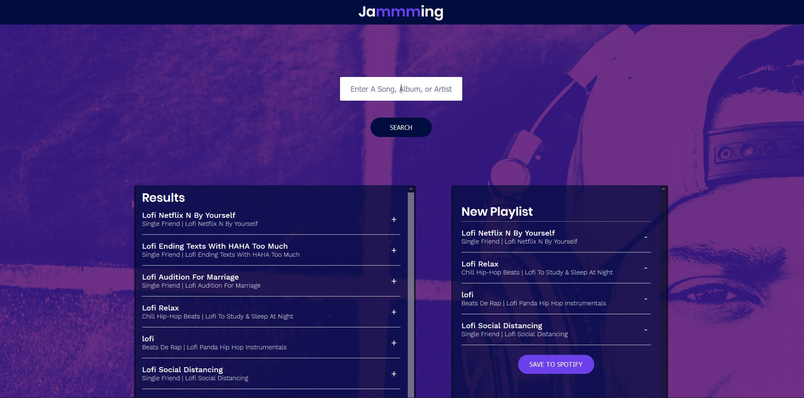

## Spotify Playlist Creator - Jammming

A front-end web application written using React.js, which utilizes the Spotify API to allow a user to create and import a public playlist.

http://tb-jammin.surge.sh/

### Preview

